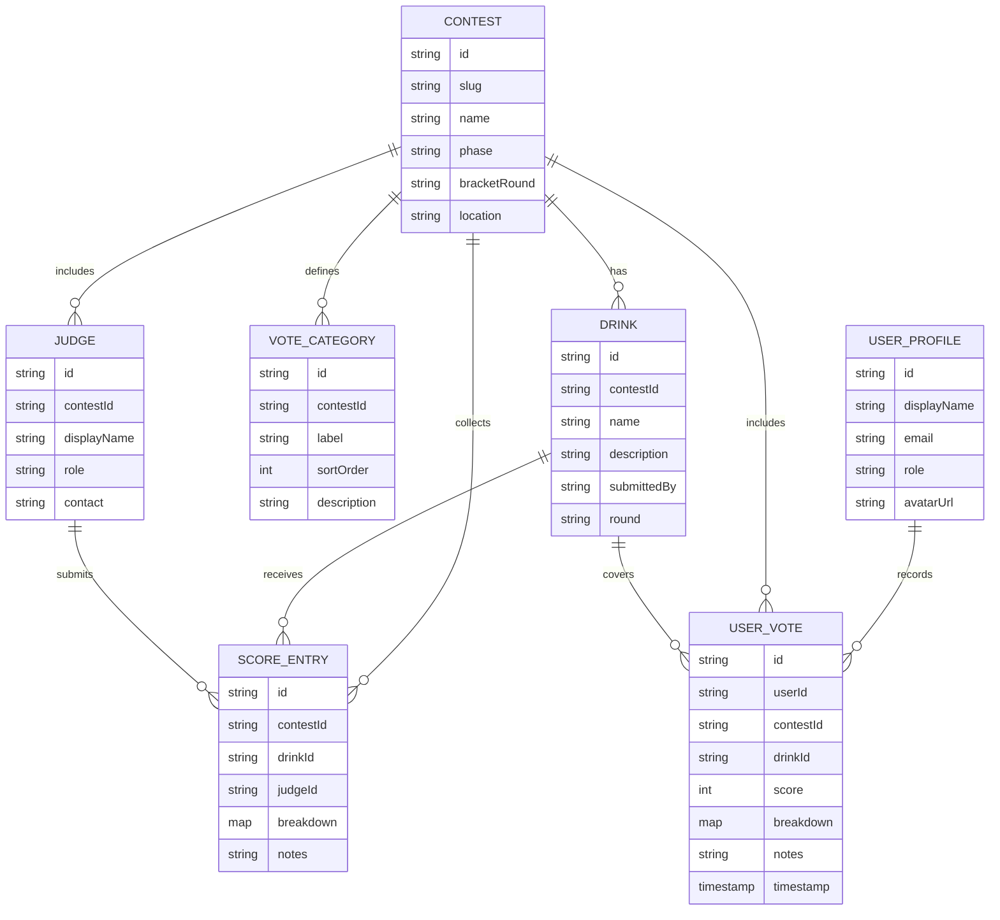

# Mixology voting ERD

## Overview
This ERD models the Mixology voting flow as implemented in the app. Contests define the overall event, categories (the scoring dimensions like aroma/balance), and the drinks that are being judged. Judges (users) submit scores per drink, which are stored as score entries with a breakdown per category. Separately, we persist a user's submitted votes in `mixology_votes` so the UI can prefill sliders for authenticated or guest sessions. Firestore rules/logic can enforce uniqueness for the `(contestId, drinkId, judgeId)` score entry and the `(userId, contestId, drinkId)` user vote so each judge has a single canonical submission per drink while still supporting per-user recall in the UI.

## ERD

